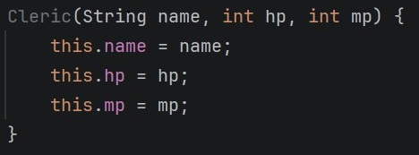

# 2026-06-09

### 2026-06-08 과제 피드백

- 매직넘버 최소화 할 것
    - final을 이용해서 의미있는 이름을 부여하여 이후에 봤을 때 이해하기 편하도록
- 가드를 잘 확인해서 작성할 것

## 수업 내용

### 클래스 형과 참조

- 가상세계라고 함은 보통 컴퓨터의 메모리 영역을 말함
- 인스턴스는 heap 영역 안에 확보된 메모리

> 메모리 영역
>
> | Code        | DATA      | BSS         | HEAP           | STACK |
> |-------------|-----------|-------------|----------------|-------|
> | 함수, 제어문, 상수 | 초기화된 전역변수 | 초기화 안된 전역변수 | 동적할당, malloc() | 지역변수  |
>

### 메모리 참조

```java
Hero hero1 = new Hero(); // 클래스를 인스턴스화 -> Heap 메모리에 new 키워드로 인스턴스 생성하고, Stack 영역 hero1에 주소 저장
hero1.hp =100;
Hero hero2 = hero1;     // Stack 영역의 hero1 주소값을 hero2에 저장
hero2.hp =200;
```

hero2.hp를 출력하면 200이 나옴
> hero2는 hero1에 저장되어 있는 Hero()의 주소값을 받아오기 때문

### Java 기본형, 참조형

- 기본형
    - int, double, float, bool, char 등
    - 기본값이 0, 0.0, false 등
    - 키워드임 Ctrl + B 를 눌러도 이동하지 않음
- 참조형
    - String, Class, Array 등
    - 기본값이 null값임
    - 명명할 때 대문자로 (ex. String, Hero)
    - Ctrl + B 를 이용하여 참조 위치로 이동할 수 있음

### 클래스 생성자(constructor)



- 생성자를 만들 경우 기본 생성자 (위에서는 Cleric();) 가 사라짐

### 정적 변수 (static)

- 모두 공유해야하는 값에서 주로 사용
- 생성 시점은 프로그램이 시작될 때 생성됨
- 인스턴스의 존재 여부와 관계없이 존재함

> **사용 예시**<br>
> 만약 Hero 라는 클래스에 `static int money = 100;` 이 있다면
> `System.out.println(Hero.money);` 로 접근할 수 있음.
> <br> main에서 Hero 클래스를 인스턴스화 하지 않아도, Hero.money를 호출 할 수 있음

