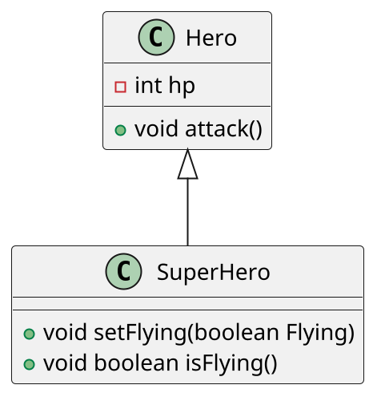

# 2026-06-16 상속

## 과제 피드백

- `assertDoesNotThrow(() -> mainTestWand.setPower(setRandomDoubleInRange), "정상 값 입력시 예외발생하는 오류 발생");` 와 같은
  랜덤값을 이용한 테스트는 지양하는것이 좋음.
    - 말 그대로 랜덤값이다보니, 성공 실패가 갈릴 수 있음
    - 경계값 테스트로 전환하여 진행할 것
- `@BeforeEach` 를 이용하여 매 테스트 실행 전에 준비작업 (`Wand testWand = new Wand();` 와 같은) 을 자동화 할 수 있음
- 코드 리뷰나 협업할 때 편하도록 한 눈에 들어올 수 있게 코드 길이를 조절할 것

---

## 상속

- 이전에 만든 클래스와 비슷한 다른 클래스를 만들 필요가 있을 때 사용

### 상속의 기초

- extends (클래스명)을 클래스 뒤에 붙여, 기존 (클래스명)을 기초로 하는 새로운 클래스 정의 가능
- 부모클래스의 멤버는 자동적으로 자식클래스에 상속
    - 추가되는 부분만 기술하면 됨
- 부모클래스에 있는 메서드를 자식클래스에서 작성하는 경우를 오버라이드한다고 함
- final을 붙인 클래스는 상속 / 오버라이드 할 수 없다.
- is-a 를 충족해야 올바른 상속
    - 예시
        1. 차는 탈 것의 한 종류다. (car is a vehicle)
        2. IPhone은 Phone의 한 종류다.
- 상속에는 추상적 / 구체적 관계에 있다는 것을 정의하는 역할도 가짐

#### 오버라이드

- 부모 클래스에서 받은 메서드를 자식클래스에 맞게 수정하는 것
- Slime에서의 attack()은 hero의 체력을 10 깍는 함수지만 <br>PoisonSlime의 attack()은 체력을 10 깎음과 동시에 독데미지로 현재 체력의 1/5 만큼 추가로 깍음
    - 코드 예시
      ```java
      // Slime 에서의 attack()
      public void attack(Hero hero) {
        if (hero == null) {
            throw new IllegalArgumentException("공격하는 대상이 있어야합니다.");
        }

        System.out.println("슬라임 " + this.suffix + "이/가 공격했다");
        System.out.println("대상 " + hero.getName() + "에게 " + slimeAttackPoint + "포인트 데미지!");

        hero.setHP(hero.getHP() - slimeAttackPoint);
      }
      
      // PoisonSlime 에서의 attack()
      @Override
      public void attack(Hero hero) {
        super.attack(hero);
        if (poisonCount > 0) {
          System.out.println("포이즌슬라임" + this.getSuffix() + "의 능력! 추가로, 독 포자를 살포했다!");
          System.out.println("대상 " + hero.getName() + "에게 " + hero.getHP() / 5 + "포인트 독 데미지!");
          hero.setHP(hero.getHP() * 4 / 5);
          poisonCount -= 1;
        } else {
          System.out.println("포이즌슬라임" + this.getSuffix() + "은 독을 모두 소모했다.");
        }
      }
      ```

### 인스턴스

- 내부에 부모클래스의 인스턴스를 가지는 다중구조를 가짐
- 보다 바깥의 인스턴스에 속하는 자식클래스의 오버라이드한 메서드부터 동작
    - 오버라이드 한 메서드 -> 자식 클래스의 메서드 -> 부모클래스의 메서드 순으로 검색하여 실행
    - 단, 생성자의 경우에는 부모 먼저 실행하고, 자식의 생성자가 실행함
    - 부모 클래스인 Hero에 있는 생성자가 자식클래스인 SuperHero에 있는 생성자보다 먼저 동작
- 외측의 인스턴스에 속하는 메서드는 super를 사용하여 내측 인스턴스의 멤버에 접근 가능

### 생성자 동작

- 다중 구조의 인스턴스가 생성되는데, JVM은 자동으로 가장 외측 인스턴스의 생성자를 호출함.
- 모든 생성자는 부모 인스턴스의 생성자를 호출 할 필요가 있음
- 생성자 선두에 `super()`가 없어도 암묵적으로 `super();` 가 추가됨

## UML

- 아래와 같이 PlantUML을 이용하여 구성도를 그릴 수 있음
- 정보를 주고받을 때 용이함



